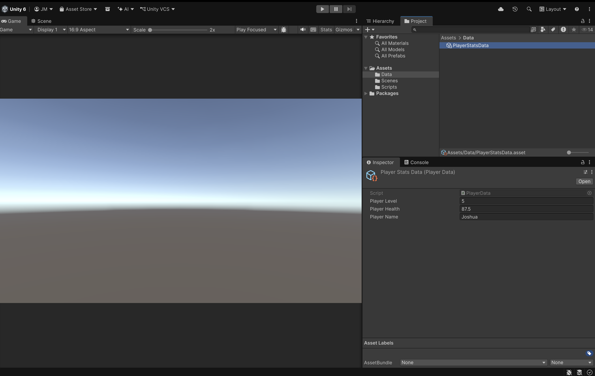
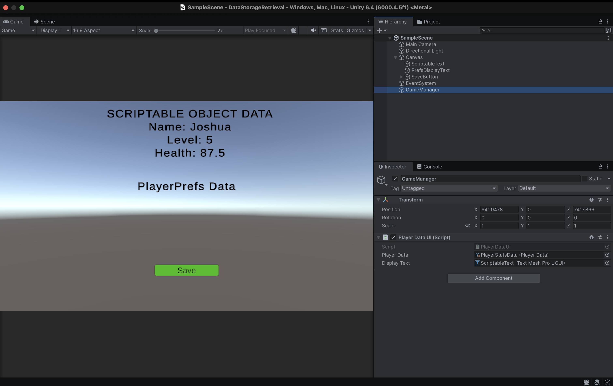
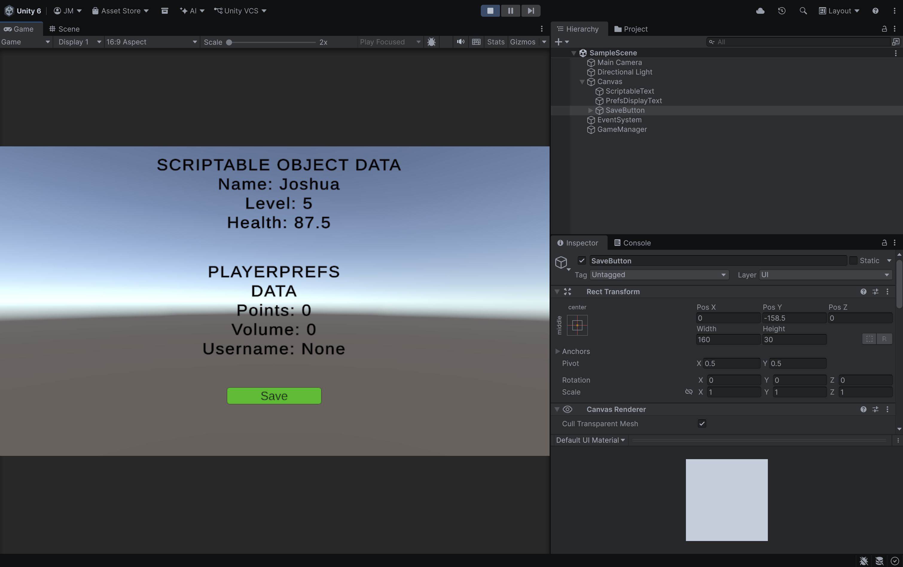
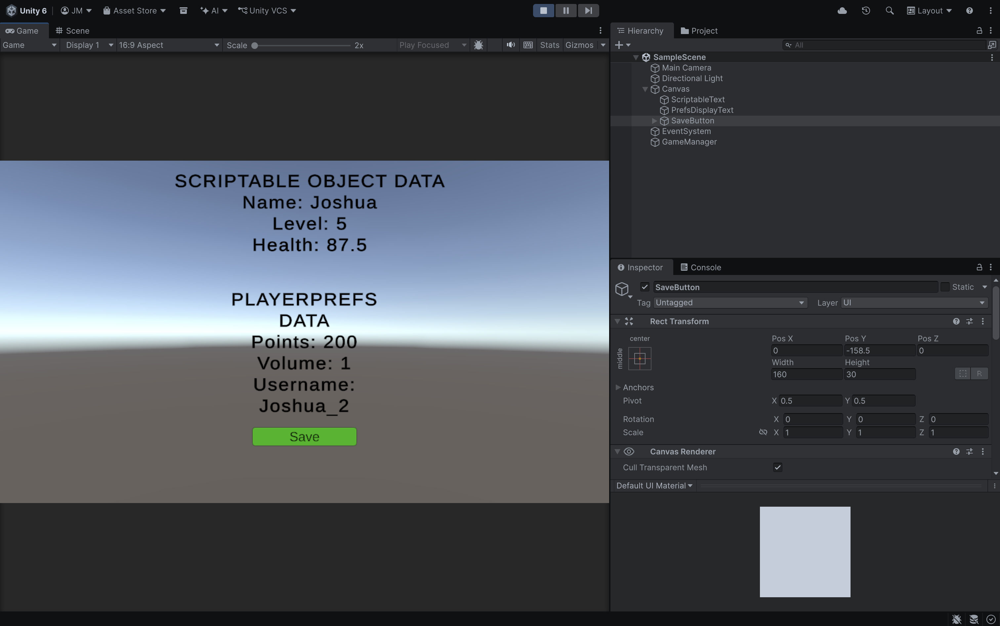
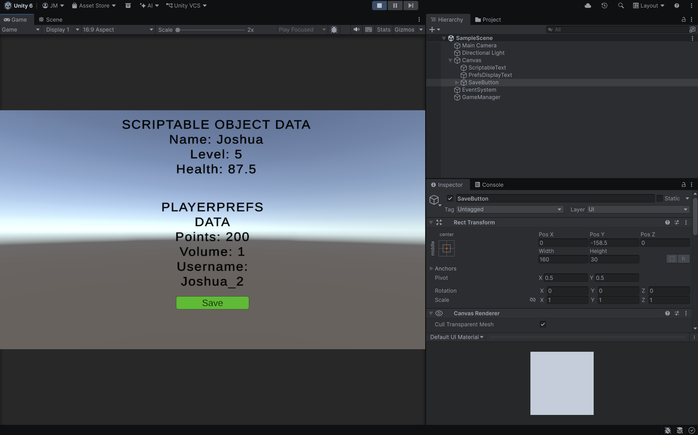

# Data Storage and Retrieval

A Unity project that shows how to store and load data using
Scriptable Objects and PlayerPrefs.

## What It Does

There are two parts:

1. **Scriptable Object** - A data holder called `PlayerData` that keeps
   three values: an int (level), a float (health), and a string (name).
   The values are set on the `PlayerStatsData` asset and shown on screen.

2. **PlayerPrefs** — Saves and loads three values (int, float, string)
   to the device and shows them on screen. The values change each time
   you click the save button.

## Scripts

- **PlayerData.cs** — A Scriptable Object. Holds level (int),
  health (float), and name (string).
- **PlayerDataUI.cs** — Reads the `PlayerData` asset and shows its
  values on the screen.
- **PlayerPrefsManager.cs** — Saves values with `SetInt`, `SetFloat`,
  and `SetString`. Loads them back with the matching `Get` calls and
  updates the screen. A counter makes the values grow on each save so
  you can see them change.

  ## How to Test

1. Open the project in Unity 6.
2. Open the main scene and press Play.
3. The Scriptable Object values display at the top of the screen.
4. Click **Save & Load** to store new PlayerPrefs values. The PlayerPrefs text
   updates each click.
5. Stop and replay, the last saved values load automatically, proving the data
   persists between sessions.

## Screenshots

**Scriptable Object Creation**

**Scriptable Object Data Displayed**

**Before Save**

**After First Save**

**Data Updating Over Time**

**Persistence**

## Author

Joshua Moses